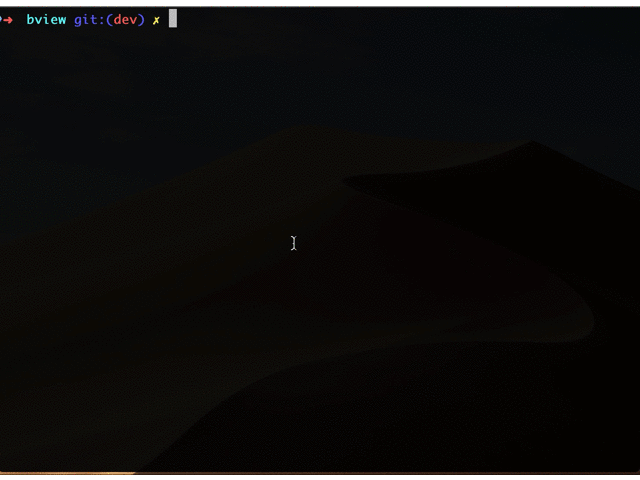

## 开发规范

### 组件录入

使用`make component input`命令新建组件，它会在默认的`src/components`生成如下结构

组件目录名称必须小写，防止在一些大小写不敏感的操作系统中，导致热更新失败
> make命令中，输入PascalCase组件名会自动转成小写的kebab-case形式

```dir

├── __tests__
│   ├── <component_name>.test.js  //  测试文件
├── demo
│   ├── basic.md                  //  基础demo
├── style                         // 组件样式
│   ├── index.js
│   ├── index.less
├── <component_name>.vue          // 单文件组件
├── index.js
├── README.st                     // 基础说明文档

```



### 组件目录名规范

组件目录名称必须是小写，如果有多个单词，推荐使用连字符`-`

### 组件编写规范

录入组件基础目录结构后，就可以开始愉快的开发之旅了，组件编写中有以下几点规范需要遵循：

-   组件.vue 文件中不可加入样式，所有样式必须写在`index.less`或它`@import`的 less 文件中。

-   组件.vue 文件中 methods 属性下，内部 api 命名需要以单个下划线开头`_`，可暴露给外部调用的 api 命名以字母开头

-   组件`.vue`文件中 name 属性为必填项，命名规则使用首字母大写，和.vue 文件名称相同即可

-   `$emit` 事件命名规范：不要使用 on 开头，命名使用-连接符


### 文档&Demo 编写规范

components 目录下每个组件目录会生成一份文档说明，文档内容包括：README.st 内对该组件的基本说明，demo 目录下的示例，组件.vue 文件中被解析出来的 api 说明。为了规范文档输出标题层级，有以下规范需要遵守：

-   README.st 中使用最高层级的标题为 h3，即`###`
-   demo 下的示例文件中使用最高层级的标题为 h4，即`####`


### 文档生成

文档资源在`site`目录下，基于单页应用，主要分为两个部分：

-   组件库的说明文档，统一放在 `site/modules` 目录下，之后会改成.md 格式文件，每个 md 文件生成一个单独路由和左侧一级根目录


### 编码规范

推荐使用[Vue 风格指南](https://cn.vuejs.org/v2/style-guide/index.html)

### ESLint disable

推荐按照配置的规则书写代码，不过有时候disable掉某些规则能避开恼人的warning，提交代码的时候则需要符合规范。开发阶段已关闭`no-console`规则，强制提交则会失败

- `JavaScript`文件注释当行`// eslint-disable-line`。更多参考[Disabling Rules with Inline Comments](http://eslint.cn/docs/user-guide/configuring#disabling-rules-with-inline-comments)

- `Vue单文件组件SFC中的template注释`。规则如下，更多参考[New: directive comments (fixes #260) ](https://github.com/vuejs/eslint-plugin-vue/pull/320)
```vue
<template>
    <div>
        disable单个特性
        <!-- eslint-disable-next-line vue/no-v-html -->
        <p class="post-excerpt" v-html="`<a>link</a>`" />
        disable以下
        <!-- eslint-disable -->
        <a>123<span>abc</span></a>
        enable以下
        <!-- eslint-enable -->
    </div>
</template>
```

### README.st

顶部yml配置中，如果`ignoreMenu`为`true`，则不会出现在左侧菜单栏中，修改st的yml配置之后，需要重新启动`npm start`


### ESLint规则


|  rules | 描述  |
|------|--------|
| [no-tabs](http://eslint.cn/docs/rules/no-tabs) | 不允许使用tab |
| [indent](http://eslint.cn/docs/rules/indent) | 使用一致的缩进，4个空格 |
| [no-multiple-empty-lines](http://eslint.cn/docs/rules/no-multiple-empty-lines) | 禁止出现多行 |
| [comma-spacing](http://eslint.cn/docs/rules/comma-spacing) | 强制在逗号周围使用空格 |
| [array-bracket-spacing](http://eslint.cn/docs/rules/array-bracket-spacing) | 要求在数组括号内使用一个或多个空格、或折行 |
| [no-regex-spaces](http://eslint.cn/docs/rules/no-regex-spaces) | 禁止正则表达式字面量中出现多个空格 |
| [block-spacing](http://eslint.cn/docs/rules/block-spacing) | 强制在代码块中开括号前和闭括号后有空格 |
| [brace-style](http://eslint.cn/docs/rules/brace-style) | 强制`one true brace style`，允许单行语句 |
| [keyword-spacing](http://eslint.cn/docs/rules/keyword-spacing) | 关键字前后至少有一个空格 |
| [no-trailing-spaces](http://eslint.cn/docs/rules/no-trailing-spaces) | 禁用行尾空白，禁止在空行使用空白符 |
| [object-curly-spacing](http://eslint.cn/docs/rules/object-curly-spacing) | 强制在大括号中使用一致的空格 |
| [computed-property-spacing](http://eslint.cn/docs/rules/computed-property-spacing) | 强制在计算属性中使用空格 |
| [func-call-spacing](http://eslint.cn/docs/rules/func-call-spacing) | 禁止函数标识符和其调用之间有空格 |
| [space-in-parens](http://eslint.cn/docs/rules/space-in-parens) | 强制圆括号内的空格 |
| [eqeqeq](http://eslint.cn/docs/rules/eqeqeq) | 要求使用 === 和 !== |
| [space-infix-ops](http://eslint.cn/docs/rules/space-infix-ops) | 确保中缀运算符周围有空格 |
| [space-unary-ops](http://eslint.cn/docs/rules/space-unary-ops) | 要求在一元操作符之前或之后存在空格 |
| [semi-spacing](http://eslint.cn/docs/rules/semi-spacing) | 强制分号之前有空格，禁止分号之后有空格 |
| [semi](http://eslint.cn/docs/rules/semi) | 禁止在语句末尾使用分号 |